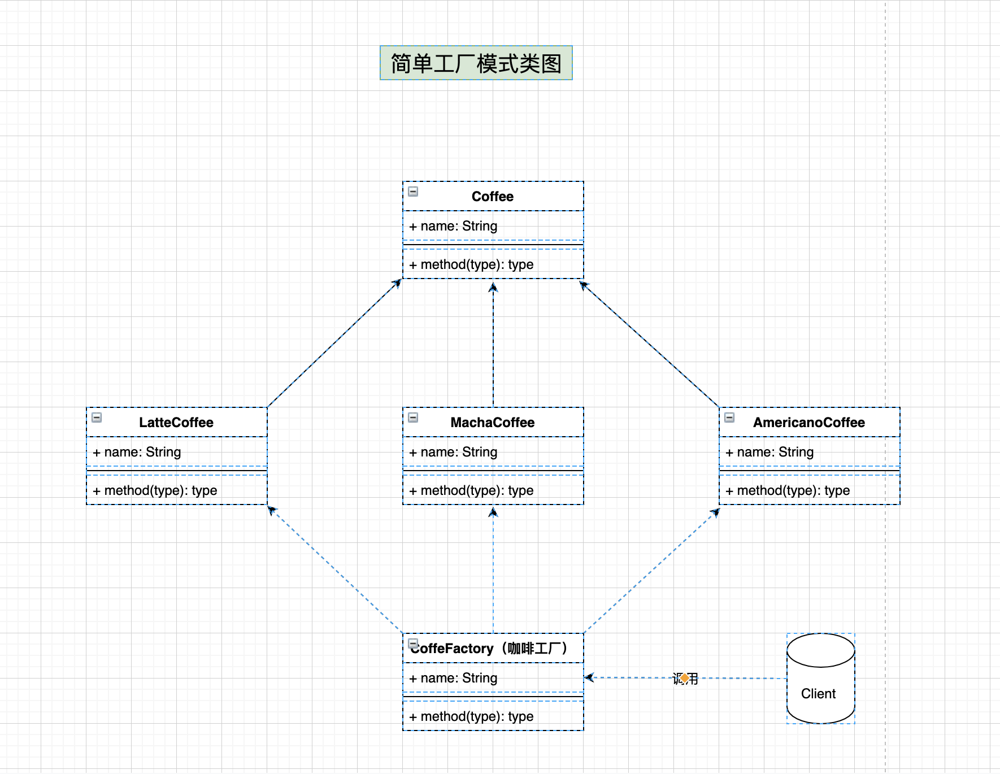
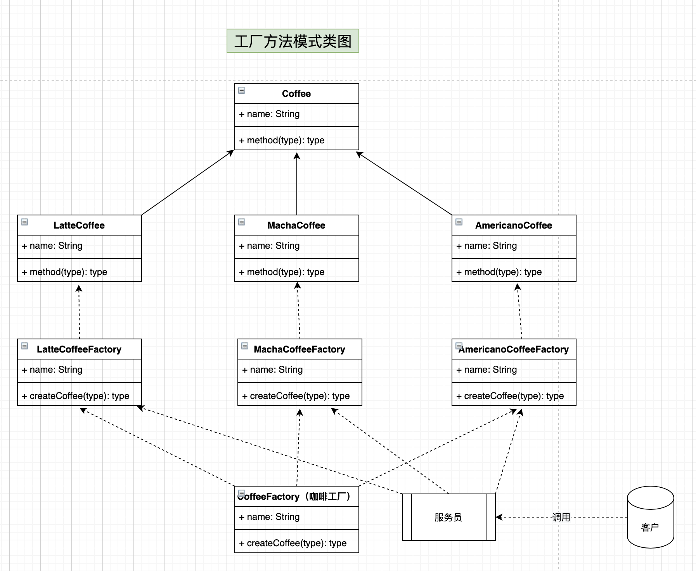
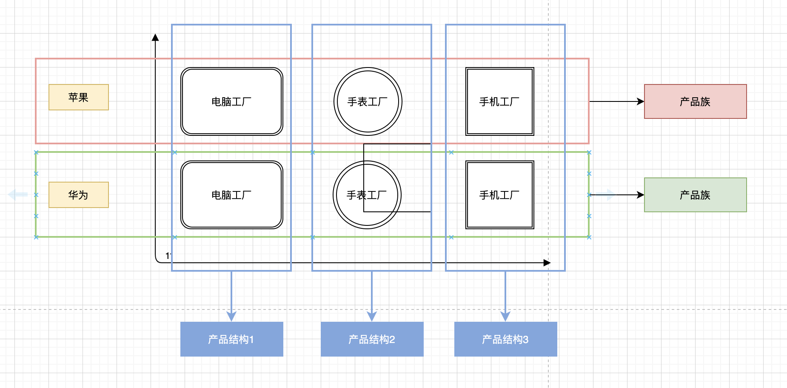
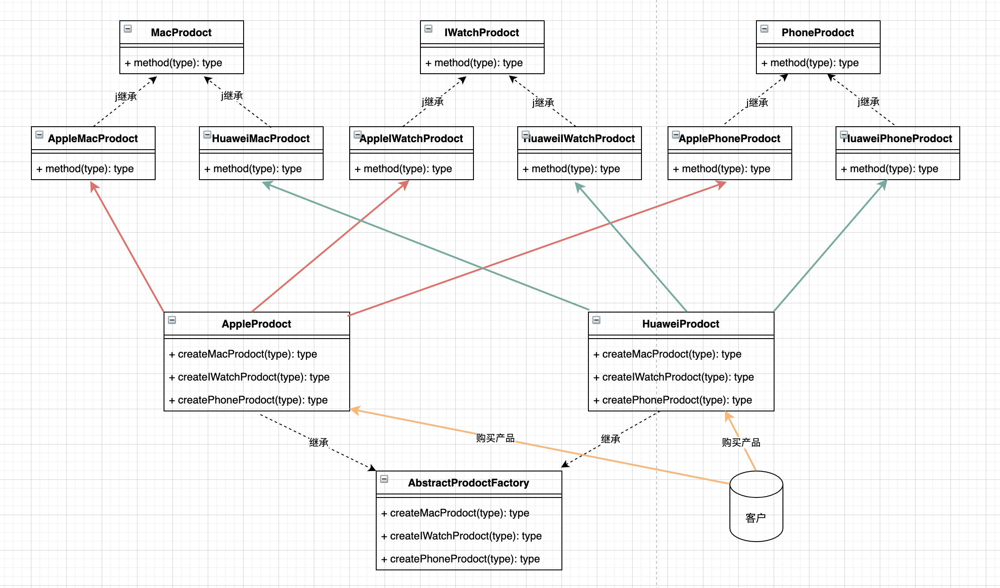

# 工厂模式

> 前言：就前端 JavaScript 语言来说，可以把简单工厂模式、工厂方法模式、抽象工厂模式归纳为一种即工厂模式；


## 一. 简单工厂模式

### 介绍/概述：

* 简单工厂模式的工厂类一般是使用静态方法，通过接收的参数的不同来返回不同的对象实例。
* 不修改代码的话，是无法扩展的，否则就违反了开放封闭原则。


### 示例：

* 客户去购买咖啡，那么可以通过 CoffeFactory 来进行购买，具体类图如下


### UML类图：




*  抽象类或接口（如上的Coffee）：定义了要创建的产品对象的接口；
* 具体实现：具有统一父类的具体类型的产品（LatteCoffee、MachaCoffee、AmericanoCoffee）；
* 咖啡工厂：负责创建产品对象，工厂模式同样体现了开闭原则，将 “创建具体的产品实现类”这部分变化的代码从不变化的代码 “使用产品” 中抽离出来，之后想要新增产品时，是需要扩展工厂的实现即可；


### 代码演示

```typescript

/**
 * 抽象咖啡类
 */
abstract class Coffee {
  constructor(public name: string) { }
}

class LatteCoffee extends Coffee { }

class MachaCoffee extends Coffee { }

class AmericanoCoffee extends Coffee { }

// 简单工厂实现
class CoffeFactory {
  static buy(name: string) {
    switch (name) {
      case 'LatteCoffee':
        return new LatteCoffee('拿铁咖啡');
      case 'MachaCoffee':
        return new MachaCoffee('摩卡咖啡');
      case 'AmericanoCoffee':
        return new AmericanoCoffee('美式咖啡');
      default:
        throw new Error('没有您需要的咖啡')
    }
  }
}

console.log(CoffeFactory.buy('LatteCoffee'));
console.log(CoffeFactory.buy('MachaCoffee'));
console.log(CoffeFactory.buy('AmericanoCoffee'));

```


### 优缺点

###### 优点：

* 客户端可以免除直接创建产品对象的责任，而仅仅是“消费”产品。简单工厂模式通过这种做法实现了对责任的分割

###### 缺点：

* 由于工厂类集中了所有实例的创建逻辑，违反了高内聚责任分配原则；
* 这种做法扩展性差，违背了开闭原则，也影响了可读性。
* 所以，这种方式使用在业务较简单，工厂类不会经常更改的情况。


### 前端应用场景

* 经典 jQuery 的创建就使用到了简单工厂； [具体源码地址](https://github.com/jquery/jquery/blob/main/src/core.js#L22)
* React 源码中的实现，判断每种类型的渲染区别以实现工厂模式；[具体源码地址](https://github.com/facebook/react/blob/master/packages/react/src/ReactElement.js#L147)
* 当然我们实际开发应用中，使用该模式的地方较多，具体不累述，需结合具体业务实现；


## 二. 工厂方法模式

### 介绍/概述：

* 工厂方法模式 `Factory Method` , 又称多态性工厂模式；
* 在工厂方法模式中，核心的工厂类不在负责所有的产品的创建，而是将具体创建的工作交给工厂子类去做；
* 也就是说针对每一种产品提供一个工厂类，通过不同的工厂实例来创建不同的产品实例。
* 在同一等级结构中，支持增加任意产品。


### 示例：

* 以上面的顾客点咖啡为例，用户只需要与咖啡店里的点餐员去进行接触点餐，然后对应的咖啡交给对应的人去制作对应的咖啡，也就是每个制作咖啡的人不是同一个人。


### UML类图：




*  抽象类或接口（如上的Coffee）：定义了要创建的产品对象的接口；
* 具体实现：具有统一父类的具体类型的产品（LatteCoffee、MachaCoffee、AmericanoCoffee）；
* 产品抽象类或接口：定义工厂方法所创建的产品对象的接口（LatteCoffeeFactory，MachaCoffeeFactory，AmericanoCoffeeFactory）
* 咖啡工厂：负责创建产品对象


### 代码演示

```typescript

/**
 * 抽象咖啡类
 */
abstract class Coffee {
  constructor(public name: string) { }
}

class LatteCoffee extends Coffee { }

class MachaCoffee extends Coffee { }

class AmericanoCoffee extends Coffee { }

// 抽象咖啡工厂类
abstract class CoffeeFactory {
  constructor() { }
}

class LatteCoffeeFactory extends CoffeeFactory {
  createCoffe() {
    console.log('您创建了一份拿铁咖啡');
  }
}
class MachaCoffeeFactory extends CoffeeFactory {
  createCoffe() {
    console.log('您创建了一份摩卡咖啡');
  }
}
class AmericanoCoffeeFactory extends CoffeeFactory {
  createCoffe() {
    console.log('您创建了一份美式咖啡');
  }
}

// 在工厂方法里，不再由 Factory 来创建产品，而是先创建了具体的工厂，然后具体的工厂创建产品
class Factory {
  static buy(name: string) {
    switch (name) {
      case 'LatteCoffee':
        // 先创建了拿铁咖啡具体的工厂，然后再由具体的工厂再创建产品
        return new LatteCoffeeFactory().createCoffe();
      case 'MachaCoffee':
        // 先创建了摩卡咖啡具体的工厂，然后再由具体的工厂再创建产品
        return new MachaCoffeeFactory().createCoffe();
      case 'AmericanoCoffee':
        // 先创建了美式咖啡具体的工厂，然后再由具体的工厂再创建产品
        return new AmericanoCoffeeFactory().createCoffe();
      default:
        throw new Error('没有您需要的咖啡')
    }
  }
}

console.log(Factory.buy('LatteCoffee'));
console.log(Factory.buy('MachaCoffee'));
console.log(Factory.buy('AmericanoCoffee'));

```


### 优缺点

###### 优点

* 允许系统在不修改具体工厂角色的情况下引进新产品

###### 缺点

* 由于每加一个产品，就需要加一个产品工厂的类，使得系统中类的个数成倍增加，增加了代码的复杂度。


### 前端应用场景

* React 源码体验 — [createFactory](https://github.com/facebook/react/blob/master/packages/react/src/ReactElement.js#L441)
* 其余结合具体业务场景实现


## 三. 抽象工厂模式

### 介绍/概述：

* 抽象工厂模式可以向客户端提供一个接口，使客户端在不必指定产品的具体的情况下，创建多个产品族中的产品对象；
* 工厂方法模式针对的是同一类或同等级产品，而抽象工厂模式针对的是多种类的产品设计；
* 系统中有多个产品族，每个具体工厂负责创建同一族但属于不同产品登记（产品种类）的产品；
* 产品族是一组相关或相互依赖的对象；
* 系统一次只能消费某一族产品，即相同产品族的产品是一起被使用的；
* 当系统需要新增一个产品族时，只需要增加新的工厂类即可，无需修改源代码；但是如果需要产品族中增加一个新种类的产品时，则所有的工厂类都需要修改。
* 抽象工厂是应对产品族概念的。比如说，每个汽车公司可能要同时生产轿车，货车，客车，那么每一个工厂都要有创建轿车，货车和客车的方法。
* 应对产品族概念而生，增加新的产品线很容易，但是无法增加新的产品。


### 示例：

* 苹果公司的苹果笔记本、苹果手表、苹果手机等等；

* 华为公司的华为笔记本、华为手表、华为手机等等；

* 以上苹果/华为公司的产品，就可以称之为产品族。

  


### UML类图：




**结构：**

* 抽象工厂：声明了创建抽象产品对象的操作接口。（**AbstractProdoctFactory**）
* 具体产品工厂：实现了抽象工厂的接口，负责创建产品对象。（**AppleProdoct、HuaweiProdoct **）
* 产品抽象类或接口：定义一类产品对象的接口（**MacProduct、IWatchProduct、PhoneProduct**）
* 具体产品实现：定义一个将被相应具体工厂创建的产品对象。（以上UML类图的六个实现类）


### 代码演示

```typescript

/**
 * 产品抽象类或接口
 */

abstract class MacProdoct { }
abstract class IWatchProdoct { }
abstract class PhoneProdoct { }

/**
 * 具体产品实现类
 */
class AppleMacProdoct extends MacProdoct { }
class HuaweiMacProdoct extends MacProdoct { }

class AppleIWatchProdoct extends IWatchProdoct { }
class HuaweiIWatchProdoct extends IWatchProdoct { }

class ApplePhoneProdoct extends PhoneProdoct { }
class HuaweiPhoneProdoct extends PhoneProdoct { }

/**
 * 抽象工厂
 */
abstract class AbstractProdoctFactory {
  abstract createMacProdoct(): MacProdoct;
  abstract createIWatchProdoct(): IWatchProdoct;
  abstract createPhoneProdoct(): PhoneProdoct;
}

/**
 * 具体产品工厂 - 苹果
 */
class AppleProdoct extends AbstractProdoctFactory {
  createMacProdoct() {
    return new AppleMacProdoct();
  }
  createIWatchProdoct() {
    return new AppleIWatchProdoct();
  }
  createPhoneProdoct() {
    return new ApplePhoneProdoct();
  }
}
/**
 * 具体产品工厂 - 华为
 */
class HuaweiProdoct extends AbstractProdoctFactory {
  createMacProdoct() {
    return new HuaweiMacProdoct();
  }
  createIWatchProdoct() {
    return new HuaweiIWatchProdoct();
  }
  createPhoneProdoct() {
    return new HuaweiPhoneProdoct();
  }
}

let huaweiProduct = new HuaweiProdoct();
console.log(huaweiProduct.createMacProdoct()); // 购买华为电脑
console.log(huaweiProduct.createIWatchProdoct()); // 购买华为手表
console.log(huaweiProduct.createPhoneProdoct()); // 购买华为手机

```


### 优缺点

**优点**

* 例如以上增加一个产品族比较方便，例如再创建一个小米，或者一个联想；

* 抽象工厂模式隔离了具体类的生成，使得客户并不需要知道什么被创建。由于这种隔离，更换一个具体工厂就变得相对容易。
* 抽象工厂模式可以实现高内聚低耦合的设计目的，因此抽象工厂模式得到了广泛的应用。


**缺点**

* 在添加新的产品对象时，难以扩展抽象工厂来生产新种类的产品，要支持新种类的产品就意味着要对该接口进行扩展，而这将涉及到对抽象工厂角色及其所有子类的修改，显然会带来较大的不便。

* 开闭原则的倾斜性（增加新的工厂和产品族容易，增加新的产品等级结构麻烦）。


## 四. 总结

**简单工厂：**

* 唯一工厂类，一个产品抽象类，工厂类的创建方法依据入参判断并创建具体产品对象。

* 适用情况包括：工厂类负责创建的对象比较少；客户端只知道传入工厂类的参数，对于如何创建对象不关心。


**工厂方法：**

* 多个工厂类，一个产品抽象类，利用多态创建不同的产品对象，避免了大量的 if-else 判断。
* 适用情况包括：一个类不知道它所需要的对象的类；一个类通过其子类来指定创建哪个对象；将创建对象的任务委托给多个工厂子类中的某一个，客户端在使用时可以无须关心是哪一个工厂子类创建产品子类，需要时再动态指定。


**抽象工厂：**

* 多个工厂类，多个产品抽象类，产品子类分组，同一个工厂实现类创建同组中的不同产品，减少了工厂子类的数量。

* 适用情况包括：一个系统不应当依赖于产品类实例如何被创建、组合和表达的细节；系统中有多于一个的产品族，而每次只使用其中某一产品族；属于同一个产品族的产品将在一起使用；系统提供一个产品类的库，所有的产品以同样的接口出现，从而使客户端不依赖于具体实现。

